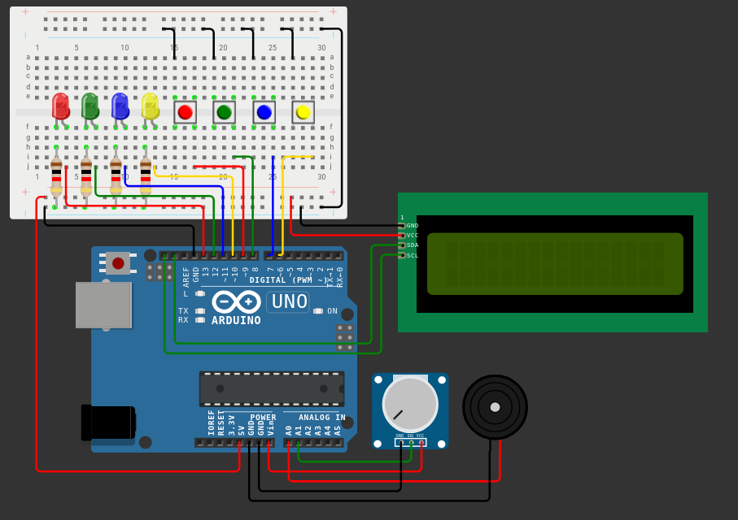

# Genius (Simon Says) com Arduino

Este projeto implementa um jogo Genius utilizando um Arduino, LEDs, botões, um buzzer e um display LCD I2C.

## Componentes

- 1 x Arduino (Uno, Mega, etc.)
- 4 x LEDs
- 4 x resistores de 220Ω para os LEDs
- 4 x botões
- 4 x resistores de 10kΩ para os botões (pull-up)
- 1 x buzzer
- 1 x display LCD I2C (16x2)
- 1 x potenciômetro
- Jumpers e protoboard

## Circuito

Monte o circuito conforme descrito abaixo:

- Conecte os LEDs nos pinos 13, 12, 11 e 10 do Arduino, cada um com um resistor de 220Ω.
- Conecte os botões nos pinos 9, 8, 7 e 6 do Arduino, com resistores de 10kΩ conectados entre os pinos dos botões e o GND (configuração pull-up).
- Conecte o buzzer ao pino A0 do Arduino.
- Conecte o potenciômetro ao pino A1 do Arduino.
- Conecte o display LCD I2C ao barramento I2C do Arduino (SDA e SCL).

## Como Jogar

1. **Inicialização**: Ao ligar o Arduino, o display LCD mostrará "Genius Game" por 2 segundos.
2. **Nova Rodada**: A cada nova rodada, o LCD mostrará "Nova rodada!".
3. **Sequência**: Uma nova cor é adicionada à sequência e é mostrada aos jogadores.
4. **Entrada do Jogador**: O jogador deve repetir a sequência pressionando os botões corretos.
5. **Verificação**: Se o jogador acertar a sequência, o LCD mostrará "Correto!" e tocará um tom de sucesso. Se o jogador errar, o LCD mostrará "Game Over!" e tocará um tom de falha.
6. **Potenciômetro**: O jogador pode regular a velocidade dos leds com o potenciomêtro
7. **Reinício**: Após uma falha, o jogo reiniciará.

## Visualização do projeto

Link para o projeto: [https://wokwi.com/projects/402703125380563969]

## Contato:

Se você tiver alguma dúvida ou sugestão, sinta-se à vontade para abrir uma issue no repositório do GitHub ou enviar um e-mail para: 
[nathanfelipi2006@gmail.com].

---

Desenvolvido com ❤️ por [Nathan Felipi Almeida].
